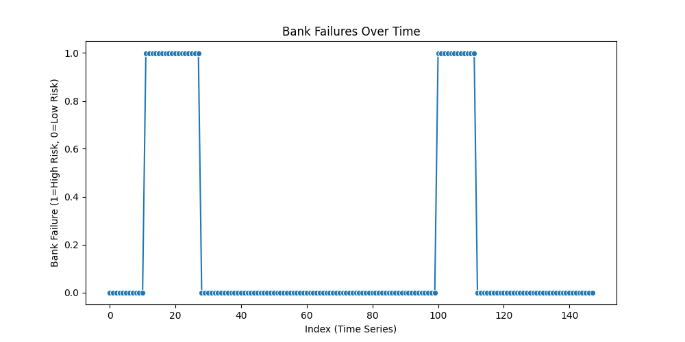
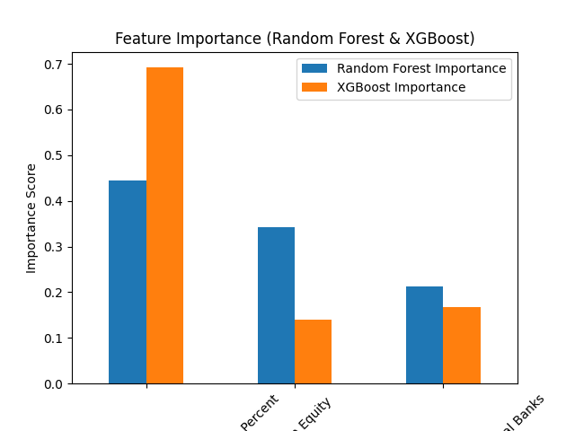
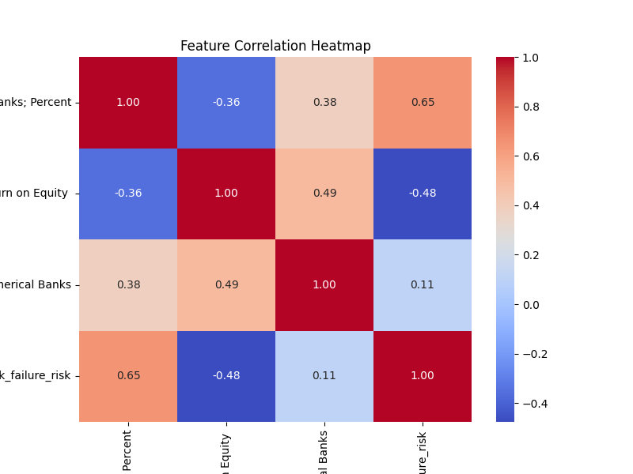

# 🏦 Bank Failure Prediction using Machine Learning

## 📌 Problem Statement
Bank failures can cause financial crises. This project uses **Machine Learning** to **predict bank failures** based on **economic and financial indicators**.

We analyze **loan reserves, interest margins, return on equity, and other key banking metrics** to determine if a bank is at risk of failing.

---

## 📊 Dataset Overview
The dataset contains **historical quarterly data** on U.S. commercial banks.  
- **Target Variable:** `bank_failure_risk` (1 = High Risk, 0 = Low Risk)
- **Key Features:**
  - **Loan Loss Reserve to Total Loans** → Measures how much a bank is saving for bad loans.
  - **Net Interest Margin** → Measures bank profitability.
  - **Return on Equity (ROE)** → Measures overall financial performance.

---

## 🔍 Feature Selection (Most Important Predictors)
📌 **Top 5 Features (Selected Dynamically)**:
1️⃣ **Loan Loss Reserve to Total Loans**  
2️⃣ **Net Interest Margin**  
3️⃣ **Return on Equity (ROE)**  
4️⃣ **Feature 4 (Automatically Selected)**  
5️⃣ **Feature 5 (Automatically Selected)**  

---

## 📊 Visualizations
### **1️⃣ Bank Failures Over Time**


### **2️⃣ Feature Importance (Random Forest & XGBoost)**


### **3️⃣ Feature Correlation Heatmap**


---

## ⚙️ How to Run the Pipeline

### 1️⃣ **Install Dependencies**
```bash
pip install -r requirements.txt